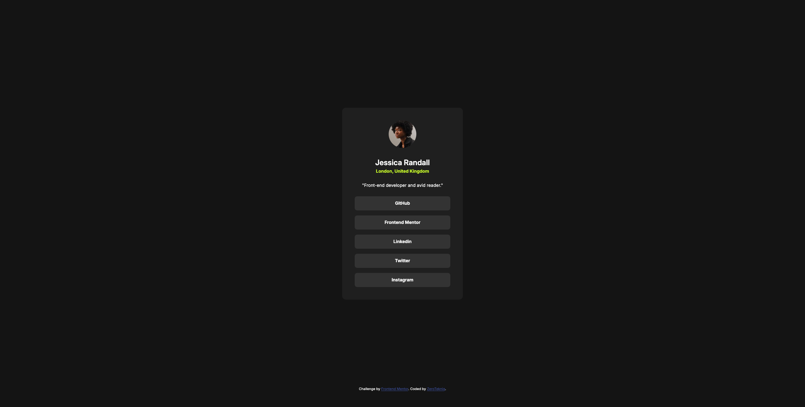

# Frontend Mentor - Social links profile solution

This is a solution to the [Social links profile challenge on Frontend Mentor](https://www.frontendmentor.io/challenges/social-links-profile-UG32l9m6dQ). Frontend Mentor challenges help you improve your coding skills by building realistic projects. 

## Table of contents

- [Overview](#overview)
  - [The challenge](#the-challenge)
  - [Screenshot](#screenshot)
  - [Links](#links)
- [My process](#my-process)
  - [Built with](#built-with)
  - [What I learned](#what-i-learned)
  - [Continued development](#continued-development)
- [Author](#author)

## Overview

### The challenge

Users should be able to:

- See hover and focus states for all interactive elements on the page

### Screenshot



### Links

- Solution URL: (https://github.com/ZeroTekniq/Socials-link-project)
- Live Site URL: (https://zerotekniq.github.io/Socials-link-project/)

## My process

### Built with

- Semantic HTML5 markup
- CSS custom properties
- Flexbox
- CSS Grid
- Mobile-first workflow

### What I learned

Relearned and reused concepts like the link attribute, and minor styling like removing underlines from hyperlinks.

```html
<a class="social-links" href="https://github.com">GitHub</a> 
```
```css
.links a {
    width: 100%;
    color: var(--white);
    text-align: center;
    font-size: var(--fs-preset-2);
    font-weight: var(--fw-bold);
    font-style: normal;
    line-height: 150%;
    display: flex;
    padding: 0.75rem;
    justify-content: center;
    align-items: center;
    align-self: stretch;
    gap: 0.5rem;
    border-radius: 0.5rem;
    background: var(--grey-700);
    border: none;
    text-decoration: none;
}
```

### Continued development

Would like to continue to hone the css rules and semantic html I have learned. Also, to start implimenting some JS in the near future.

## Author

- Website - [Add your name here](No website)
- Frontend Mentor - [@](https://www.frontendmentor.io/profile/DigitalJsn)

